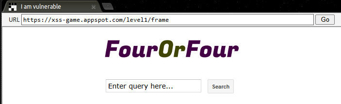
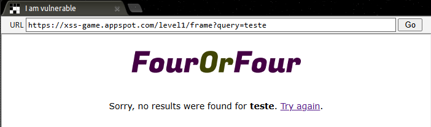
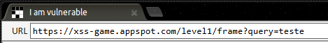
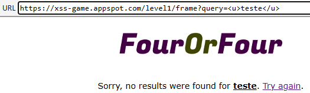
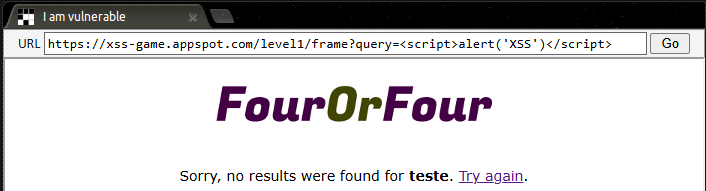

### Missão

Injete um script para exibir um alerta JavaScript (`alert()`) no frame abaixo.

Uma vez que o alerta for exibido, você poderá avançar para o próximo nível.

---

O desafio começa com essa simples página de busca, onde se pode inserir caracteres tanto no campo de busca quanto na URL, para fins de teste, foi escrito a `teste` no campo de busca e o resultado foi o seguinte:

Ao inserir a palavra "teste" na página de busca e nota-se que ela aparece na URL como parte da query , isso indica que os dados não foram tratados adequadamente. O que significa que é possível injetar códigos na própria URL a partir do ponto onde a palavra é colocada após o`` "query="``.

Para exemplificar o que foi dito, eu coloquei o elemento `<u>` na URL, este faz com que o texto fique sublinhado, o que nos da a prova de que a URL interage diretamente com a busca na página

Sabendo dessa informação e de que o objetivo do desafio é  injetar um código de alerta na página para passar de nível, podemos testar o script abaixo com a função Alert do próprio Javascript. 

``

Dessa forma, a página interpreta a tag `<script>` e trata tudo o que estiver dentro como um código. Quando o `alert('XSS')` é executado, faz com que uma janela apareça na tela do usuário com a mensagem "XSS" escrita. Nesse caso eu testei na URL da página para que seja melhor pra ver, mas poderia ser colocado tanto no campo de busca, quanto no código-fonte ao inspecionar a página

Após clicar em Go aparece a seguinte frase na Janela e assim podemos avançar para o próximo nível

