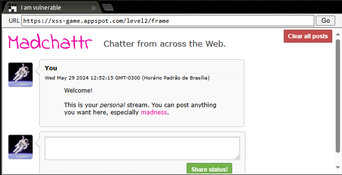
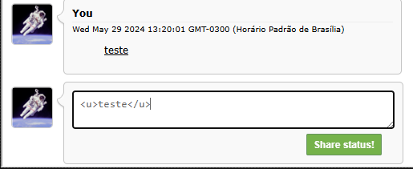
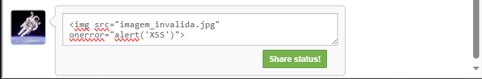
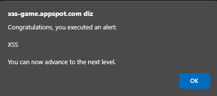

## Descrição da Missão 

Aplicações web frequentemente armazenam dados de usuários em bancos de dados no servidor e, cada vez mais, no lado do cliente, para posteriormente exibi-los aos usuários. Não importa de onde vêm esses dados controlados pelo usuário, eles devem ser tratados com cuidado.

Este nível mostra quão facilmente bugs de XSS podem ser introduzidos em aplicativos complexos. 

## Objetivo da Missão

Injete um script para exibir um `alert()` no contexto da aplicação.

Observação: a aplicação salva suas postagens, então se você inserir código para executar o alerta, este nível será resolvido toda vez que você recarregá-lo

---

No inicio do desafio temos esse chat de texto que contém uma área de input de texto, vamos fazer alguns testes nela

Tentaremos agora enviar um novo teste porém com a tag `<u>` para ver se o texto será sublinhado ao enviar

Ao testar `<u>teste</u>`, podemos perceber que nosso texto passa pelo servidor e banco de dados mesmo com as tags HTML, o que significa que quando esses elementos HTML são renderizados na página, eles também são interpretados pelo DOM (Document Object Model).

O DOM é responsável por representar e organizar a estrutura de um documento HTML ou XML. Quando o navegador renderiza uma página, ele constrói o DOM a partir do código HTML e, durante esse processo, os elementos HTML são interpretados e exibidos na interface do usuário. O DOM permite que os elementos HTML sejam interpretados e exibidos na página, mas ele não executa scripts embutidos diretamente a menos que seja especificamente projetado para isso

Uma forma de burlar as medidas de segurança do DOM é manipulando o evento `onerror` em uma tag ``. Este evento é acionado quando ocorre um erro ao carregar uma imagem ou outro recurso da web.  Dessa forma, é possível forçar uma interação onde supostamente uma imagem não é carregada e assim acionar o evento de `oneerror`, que executa uma função Javascript e que pode ser utilizada para injetar um código malicioso.

Tentaremos o seguinte

``

Caso a página não esteja devidamente tratada, quando clicarmos em "Share Status!" o código Javascript vai gerar um alerta na página onde será possivel ver "XSS" escrito

E como resultado, veremos este alerta e será possível avançarmos para o próximo nível

