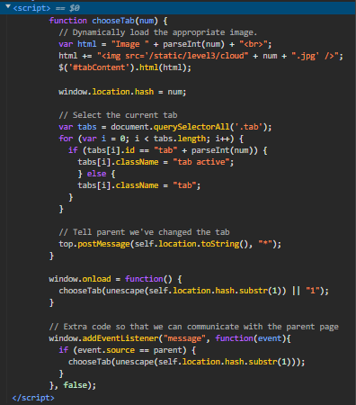
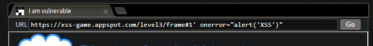
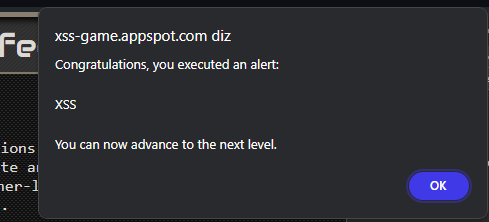

## Descrição da Missão

Como você viu no nível anterior, algumas funções comuns de JavaScript são pontos de execução, o que significa que elas farão o navegador executar qualquer script que aparecer em sua entrada. Às vezes, esse fato é ocultado por APIs de alto nível que usam uma dessas funções em segundo plano.

A aplicação neste nível está usando um desses pontos de execução ocultos.

### Objetivo

Como antes, injete um script para exibir um alerta em JavaScript (alert()) no aplicativo.

Como você não pode inserir seu payload em nenhum lugar da aplicação, você terá que editar manualmente o endereço na barra de URL abaixo.

#### Dicas

1. Para localizar a causa do bug, reveja o JavaScript para ver onde ele lida com a entrada fornecida pelo usuário. 
2. Os dados no objeto `window.location` podem ser influenciados por um atacante.
3. Quando você identificar o ponto de injeção, pense sobre o que você precisa fazer para introduzir um novo elemento HTML.
4. Como antes, usar `<script> ...` como payload não funcionará porque o navegador não executará scripts adicionados após o carregamento da página.

---

## Passo 1 - identificar o ponto de injeção

Verificar o JavasCript que está sendo executado na página com o objetivo de encontrar onde a entrada do usuário está sendo manipulada. De acordo com as dicas o objeto `window.location` pode ser manipulado pelo atacante.

`window.location` é um objeto em JavaScript que contém informações sobre a URL atual do documento. Ele permite que você leia ou altere diferentes partes da URL.

O `window.location.hash` em particular refere-se à parte da URL que segue o `#` (hash), e é frequentemente usado para navegação em páginas de uma única página (SPA) ou para ancoragem em partes específicas de uma página.

Por exemplo, se a URL for `http://www.exemplo.com/pagina.html#seção1`, `window.location.hash` será `#seção1`.

## Passo 2 - Analisar o código

- **Função `chooseTab(num)`**:
    
    - Constrói o HTML para carregar a imagem apropriada de forma dinâmica.
    - Utiliza `num` para construir a string HTML que é inserida no DOM.
    - Atualiza o `window.location.hash` com o valor de `num`.
    - Seleciona a aba atual e comunica a mudança para a página pai via `postMessage`.

- **Carregamento Inicial**:
    - A função `chooseTab` é chamada no carregamento da página com o valor do hash (ou "1" se o hash estiver vazio).

- **Evento de Mensagem**:
    - `chooseTab` também é chamado quando uma mensagem é recebida da página pai, usando o valor atual do hash.

#### Possível ponto de Injeção

A variável `num` é usada diretamente para construir o HTML que é inserido no DOM, sem nenhuma validação adequada. Isso pode ser explorado para injetar um script.

Por exemplo, no código:

`var html = "Image " + parseInt(num) + " "; html += ""; $('#tabContent').html(html)

## Passo 3 - Injetar o Payload

1. **Modificar o URL**:
    -  Como a imagem é carregada diretamente pela URL da página, precisamos manipular a URL para influenciar o carregamento da imagem.
	- O código mencionado usa `num` para referenciar uma imagem e atualiza `window.location.hash` com esse valor.
	- Vamos manipular a URL para que o valor de `num` seja interpretado como o final da linha do código, evitando a leitura do `.jpg`.
	- Ao fazer isso, a URL não encontrará a imagem no banco de dados e poderemos inserir uma tag `onerror` para gerar um alerta na página.

Conforme descrito acima, a URL ficaria da seguinte forma:

O resultado então é este:

