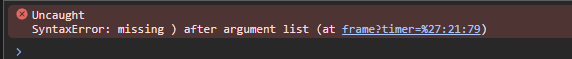
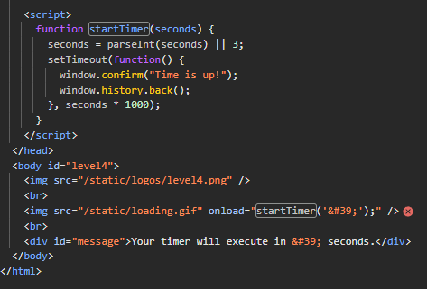
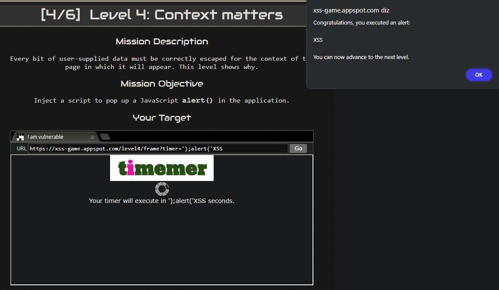

Descrição da Missão 
Cada dado fornecido pelo usuário deve ser corretamente tratado para o contexto da página em que aparecerá. Este nível mostra por que isso é importante.

Objetivo da Missão 

Injete um script para abrir um alerta JavaScript na aplicação.

Dicas 3/3
``- 1. Dê uma olhada em como a função startTimer é chamada.
``- 2. Quando os navegadores analisam atributos de tags, eles decodificam primeiro seus valores para HTML. <foo bar='z'> é o mesmo que <foo bar='&#x7a;'>
``3. Tente inserir uma aspa simples (') e observe o console de erros.``

## Entendendo as dicas

Para resolver o desafio é preciso entender o que as dicas estão nos dizendo

Começando pela dica 3, vamos inserir uma aspas simples no input e ver o que acontece no console

A mensagem de erro "Uncaught SyntaxError: missing ) after argument list" indica que há um erro de sintaxe no código JavaScript que está sendo executado. Especificamente, o erro sugere que está faltando um parêntese de fechamento após a lista de argumentos em uma função.

A função a que ele se refere entre os parenteses finais é a seguinte:

**Chamada da Função `startTimer`:**

- Dentro do corpo da página (`<body>`), há uma tag `` com o atributo `onload="startTimer('&#39;');"`. Isso significa que quando a imagem é carregada, a função `startTimer` é chamada com o argumento `&#39;`.

- `&#39;` é uma entidade HTML que representa o caractere de aspa simples (') em ASCII. Este valor está no código porque ao processar atributos de tags HTML, os navegadores decodificam primeiro os valores das entidades HTML antes de processá-los.

- Quando inserimos as aspas simples (`'`) no input, ocorreu um erro porque as aspas simples dentro de um atributo de uma tag HTML podem interferir na sintaxe do próprio HTML ou do JavaScript. O código ficou assim:

``

## Injetando o código na página

Sabemos que o input espera um número para que a função `startTimer` seja executada corretamente, e que se colocarmos uma aspas simples vamos gerar um erro na sintaxe do código. Podemos usar isso para forçar um erro e executar um outro comando logo após este erro. Vamos testar o seguinte:

`';alert('XSS

- a aspas simples `'` vai gerar o erro no código
- O ponto-e-vírgula `(;)` em JavaScript é usado para separar instruções ou comandos. Ele indica o fim de uma instrução e o início de outra.
- o `alert('XSS` indica que a função `alert` será gerada logo após o erro. Note que não fechei os parênteses porque se eu tivesse feito, o código seria interpretado da seguinte forma:

onload="startTimer('&#39;**);alert(&#39;XSS&#39;)**);" />

Ao invés de ficar dessa forma:

onload="startTimer('&#39;);**alert(&#39;XSS&#39;**');" />

- A inclusão do `')` no final da injeção do código faria com que fosse gerado um erro de sintaxe no console, mas não faria com que o alerta fosse gerado na página, porque o JavaScript não entende essa sequência como algo válido (especificamente o ponto-e-vírgula e o parêntese final), o que  impedindo a execução correta da instrução `alert`.

Ao injetar o código corretamente na pagina temos o seguinte resultado:

