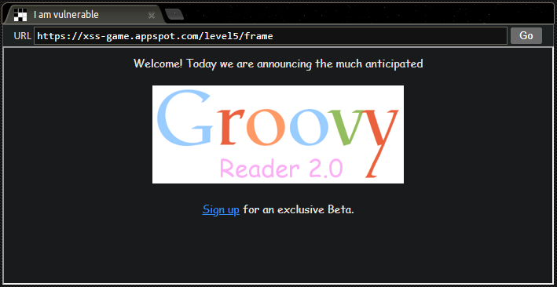
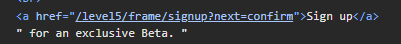
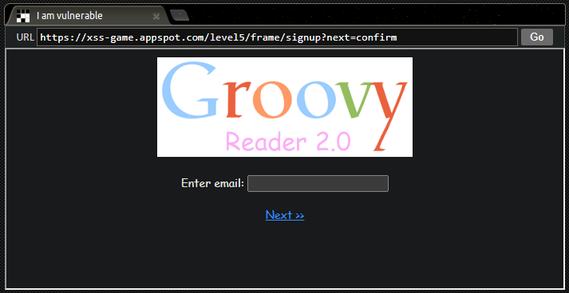
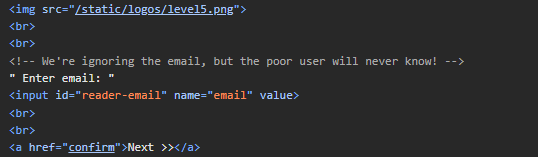
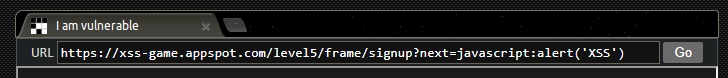
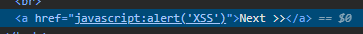
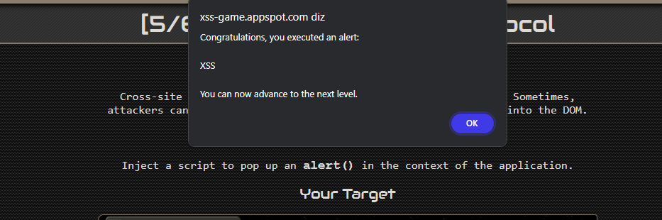

## Descrição da Missão

Cross-site scripting não se trata apenas de manipular corretamente os dados. Às vezes, os atacantes podem fazer coisas ruins mesmo sem injetar novos elementos no DOM.

### Objetivo

Injetar um script para exibir um alerta (alert()) no contexto da aplicação.

#### Dicas

1. O título deste nível é uma dica (breaking protocol).
2.  É útil olhar o código fonte do frame de cadastro e ver como o parâmetro de URL é usado.
3.  Se você quiser fazer com que clicar em um link execute JavaScript (sem usar o manipulador onclick), como você pode fazer isso?

## Entendendo o que o título Breaking Protocol diz

podemos entender das seguintes formas

- **Violação de Normas de Segurança:**
    
    - Refere-se a ações que violam os protocolos de segurança estabelecidos, como a introdução de scripts maliciosos onde não deveriam estar.
    
- **Desvios dos Padrões Comuns:**
    
    - Indica a exploração de vulnerabilidades ao desviar dos padrões normais de comportamento do navegador ou da aplicação web.
- **Manipulação de URLs:**
    
    - Pode sugerir a alteração de parâmetros em URLs para executar scripts de maneira não convencional, sem a necessidade de injeção direta no DOM.
- **Uso Criativo de Funcionalidades:**
    
    - Envolve o uso criativo de funcionalidades já presentes na página para executar código JavaScript, como transformar links ou outros elementos em executores de scripts.

Então,  o título sugere que teremos que "quebrar" algum protocolo ou seguir um caminho não convencional para passar de fase. Isso pode envolver explorar a forma como a página lida com URLs, parâmetros, ou o comportamento dos links e scripts.

## Análise das páginas

### Página inicial

A pagina inicial não tem nenhum recurso que eu pude explorar, mas no corpo do código fonte existe uma linha interessante, ao qual podemos investigar

Esta linha do código é o link que faz referência à próxima página, podemos perceber que o caminho do link é `.../signup?next=confirm`

- `signup` faz referencia a página ao qual o link será redirecionado
- `?` indica o início dos parâmetros de consulta (query parameters) na URL
- `next=confirm` é um parâmetro de consulta. Nesse contexto, `next` geralmente é usado para indicar a página para a qual o usuário será redirecionado após concluir a ação atual, que será a página `confirm`.

### Página de formulário

Clicando no link Sign Up somos redirecionados para uma página de formulário, e a URL atual é a mesma que estava fazendo referência ao `href` no código-fonte da página anterior

Investigando o corpo do código-fonte dessa nova página percebi o seguinte

- Como o próprio comentário diz, <!-- We're ignoring the email, but the poor user will never know! --> a página ignora o que for colocado no input. Sendo assim, podemos descartar a idéia de injetar um script nesse campo.

- Teremos que focar na URL e como ela é manipulada no código da pagina
## Injeção do código

- O parâmetro `next` na URL é usado para direcionar o usuário para a próxima etapa ou página após uma ação específica, como clicar em um botão de confirmação ou Link do formulário.
- Neste caso específico, o parâmetro `next=confirm` indicava que, ao clicar em "Next" na página de inscrição, o usuário seria redirecionado para uma página de confirmação.

Será preciso modificar o valor do parâmetro `next` para incluir um script. Por exemplo:

``signup?next=javascript:alert('XSS')``

E assim investigarmos se o valor do parâmetro `next` é inserido diretamente na página ou se é usado de outra maneira que possamos explorar.

Ao apertar 'Enter' teclado ou 'Go' na página, conseguimos inserir esse código no `href` da página, onde antes tinha o link executando a ação de levar o usuário para a página de confirmação, agora tem um código de alerta inserido que será executado quando clicarmos em Next

Assim que apertamos o Link de Next, conseguimos injetar o código e passar para a próxima fase

